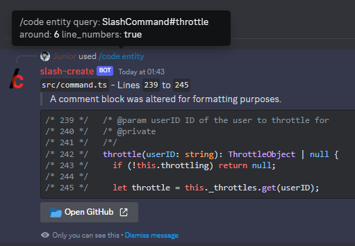
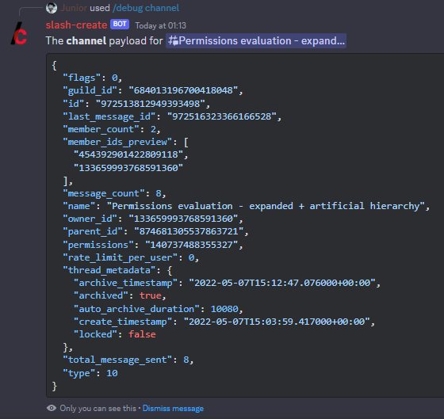
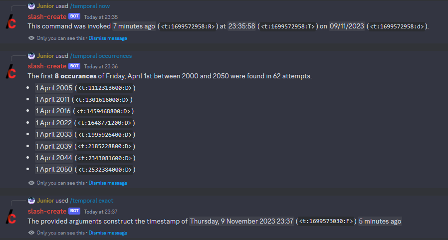

# docs-bot
A service that handles navigation of a docgen project manifest.

## Functionality

> - `*` - Autocompletion available
> - `?` - Optional
> **All other arguments are required, unless otherwise specified.**

- For `/docs` specifically, if searching for an entry other than the `class` itself - and the option is available, the `class` **must** be searched for first (except `typedef`, they share runtime flow).

### Command List

```sh
$ npx slash-up list

/docs - Search documentation entries.
    class - Get entry for a class.
        class* string - The class to retrieve.
        share? boolean - Share the outcome of your query to the channel.
    event - Get entry for an event.
        class* string - The class to retrieve.
        event* string - The event to retrieve.
        share? boolean - Share the outcome of your query to the channel.
    method - Get entry for a method.
        class* string - The class to retrieve.
        method* string - The method to retrieve.
        share? boolean - Share the outcome of your query to the channel.
    prop - Get entry for a class prop.
        class* string - The class to retrieve.
        prop* string - The prop to retrieve.
        share? boolean - Share the outcome of your query to the channel.
    typedef - Get entry for a type definition.
        typedef* string - The typedef to retrieve.
        share? boolean - Share the outcome of your query to the channel.

/code - Get a section of code from the source repository.
    entity - Fetch a file from a type entity.
        query* string - The query to search all entries.
        around? integer - How many lines to retrieve around the entity. (default = 3)
        offset? integer - Offset the selection view.
        share? boolean - Share the outcome of your query to the channel.
        line_numbers? boolean - Include line numbers in code response. (default=false)
    lines - Fetch specific lines from the source code.
        query* string - The query to search all entries.
        start integer - Where to select from.
        end integer - Where to select to.
        share? boolean - Share the outcome of your query to the channel.
        line_numbers? boolean - Include line numbers in code response. (default=false)

/search - Search for a documentation entry.
    query* string - The query to search all entries.

/temporal - Simplified use of Discord\'s time syntax.
    now - Get the current time.
    occurrences - Get all occurrences of a day of the week for a day/month set between two specified years.
        weekday integer - The day of the week to focus on.
        date integer - The date of the month to cycle through = [1, 31].
        month integer - The month of the year to cycle through.
        start_year integer - The year to start the search from.
        end_year integer - The year to end the search at.
        select? string - Selection type. (default = "first")
        count? integer - Selection count. (default = 5)
    parse - Parse string query with chrono-node parse. (GitHub: https://github.com/wanasit/chrono)
        query string - The query to parse (context around date strings are not provided in response).
        instant? integer - A time instant. If it is for the timestamp markup, add three zeros to the end. (default = {now})
        forward_date? boolean - Should the parser only return results forward of the temporal instant. (default = false)
        select? string - Selection type. (default = "first")
        count? integer - Selection count. (default = 3)
    exact - Construct a Discord timestamp.
        year integer - The year of the timestamp.
        month integer - The month of the timestamp.
        day integer - The day of the timestamp.
        hour integer - The hour of the timestamp.
        minute integer - The minute of the timestamp.
        second integer - The second of the timestamp.

/debug - Debug provided entities for interaction contexts.
    user - Print the payload for yourself or the target user.
        target? user - The user to target for debug. (default = @me)
    channel - Print the payload for the target channel.
        target? channel - The channel to target for debug.
    role - Print the payload for the target role.
        target role - The role to target for debug.

Debug Message (MESSAGE)

Debug User (USER) -> /debug user target: {SELECTED}
```

### Showcase

- `/docs class class: SlashCreator`

  

- `/docs method class: MessageInteractionContext method: registerComponentFrom`

  

- `/code entity ...`

  

- `/debug channel target?: {TYPE}`
  | **(Announcement) Thread (10)** | **(Channel) Thread (11)** | **(Forum) Thread (11)** |
  | ------------------------------ | ------------------------- | ----------------------- |
  |  |  |  |

- `/temporal now`

  

Full set of example responses are available from [the assets folder](./assets/commands/).

## Installation

```sh
git clone https://github.com/slash-create/docs-bot.git
cd docs-bot
# create the ".env" file and edit the variables (Configuration below)!
npx slash-up sync
yarn build
yarn start
```

### Configuration

> Derived from [the default configration](./app.json) without debug options.

| Key | Description |
| --- | ----------- |
| DISCORD_APP_ID | The application ID of the Discord app. |
| DISCORD_PUBLIC_KEY | The public key of the Discord app. |
| DISCORD_BOT_TOKEN | The bot token of the Discord app. |
| PORT | The port to listen on. |
